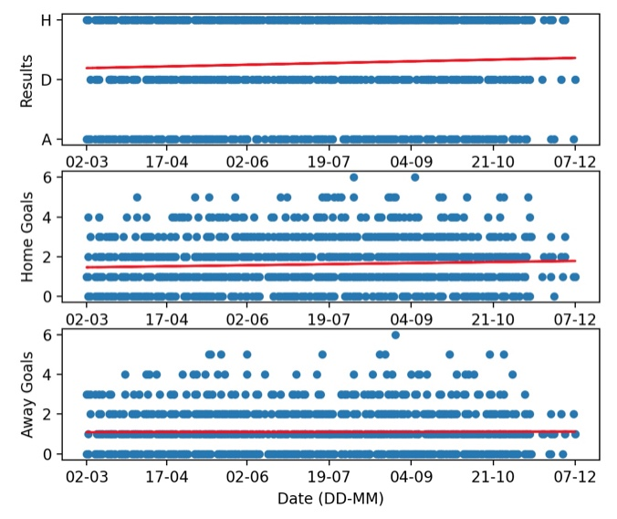
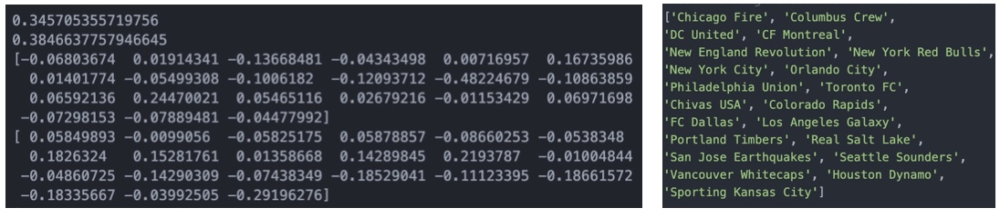
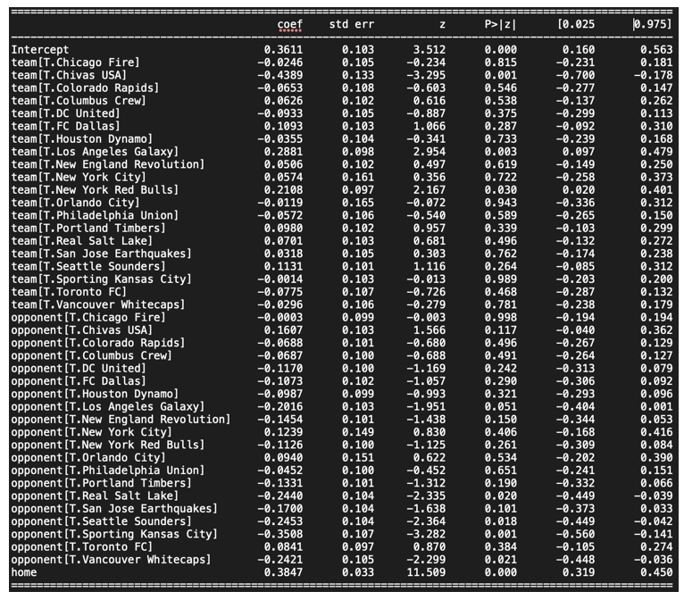
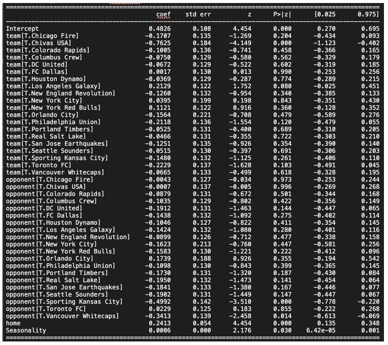
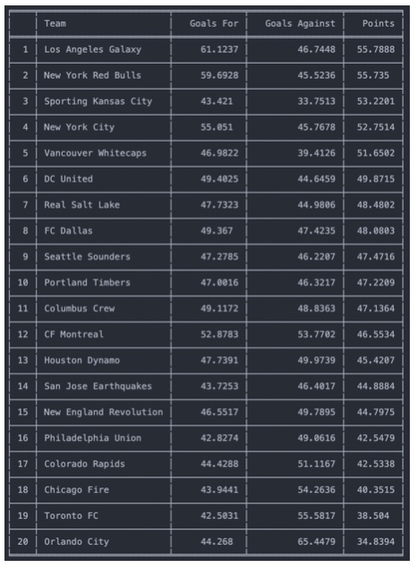
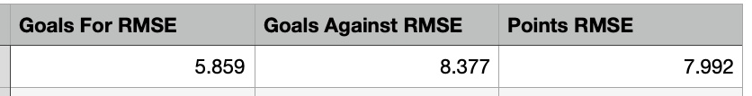

# MLS Model

## Editing data

In *editing_data.py*:

Load the data downloaded from https://football-data.co.uk as *data.csv*, and after editing save it as *edited_data.csv*.

## Descriptive Statistics

In *descriptive_stats.py*:

416/1371 = 30.34% of the matches in the fitset are between teams from different conferences.

Home advantage, which I measured as the ratio: no. home points / no. away points, is 2.1017 in the Western Conference and 1.7812 in the Eastern Conference. This is over 401 {'H': 213, 'A': 83, 'D': 105} and 554 {'H': 287, 'A': 143, 'D': 124} matches respectively.

**Seasonality:**
As can be seen in the figure, as the season continues the impact of home advantage seems to increase as a larger proportion of games are won by the home team as seen in the top plot. This is naturally due to the home team scoring more goals, as seen in the middle plot, whilst the away team scores a constant number throughout the season, as seen in the bottom plot.

Home advantage can be attributed to the crowd, travel, familiarity, referee bias and tactic changes due to understanding of home advantage. Of these travel would be likely to cause a bigger impact as the season progresses as teams get fatigued throughout the season. This is especially true in the MLS as teams need to travel further for games compared to other leagues due to the US and Canada being much larger than counties like UK or Germany.

It is also worth noting this dataset includes games from the post-season playoffs, where the higher- seeded team hosts. This leads to more home wins than usual, which could be responsible for the shown increase in home advantage.

## A Simple Model

log(lamda) = gamma + eta/2 + alpha[i] + beta[j]

log(mu) = gamma - eta/2 + alpha[j] + beta[i]

- Alpha - attacking (scoring) ability of each team
- Beta - defensive (higher is worse) ability of each team
- Gamma - goal constant, acting as the fixed intercept
- Eta - home advantage

**Assumptions:**
Since the model follows a Poisson distribution, we assume goals are independent of each other, the rate of goals over time remains constant and two events cannot occur at the same time.
A constraint of a maximum of 10 goals per side is added since there are no data points with more than 10 goals.

In *basic_model.py*:
Used *scipy.optimize.minimize* to fit the model, giving a log-likelihood of -3937.247 and parameters shown below in order gamma, eta, alpha, beta. Alpha[i] and beta[j] team order is shown. Parameters are saved as *parameters.npy*.

In *basic_model_statsmodel*:
I used the statsmodels module, which allowed me to fit a Poisson model much more efficiently and also achieved a log-likelihood of -3937.2. The parameters are shown below in the order gamma, alpha, beta, eta. Because of statsmodel’s usability, I will progress using this model.
Model A is saved as *goals_model*.

## Model Extensions

**Possible model improvements:**
- More recent matches should be weighted more heavily as they are more indicative of current
performance. This also captures how a team's form can change drastically over the course of a
season.
- Include a vector parameter to account for how different teams have different levels of home advantage. For example, a team with a large and active fan base would create a bigger home advantage than one which often has a half-empty stadium. A similar effect could occur if a stadium is in a different climate (ie. colder) as the home team would be better adapted to these conditions.
- Include a vector parameter to account for how the number of days since the last match a team played affects their performance due to fatigue.
- Include a matrix parameter to account for head-to-head performance for each fixture combination. This would capture how teams can consistently perform better or worse against certain opposition.

**Implementing more recent matches carrying a larger weight:**
- Add another column in the dataframe for weighting for each fixture. This would be an
exponentially decreasing value as the date gets further from 06/12/2015.
- When calculating the log-likelihood for X and Y, multiply each component by its weight. This can
be achieved by setting freq_weights=df[‘weights’] when fitting the model.
- Now the output parameters of the model will be more influenced by recent results.

**Additional data which would be useful to consider:**
- Transfer window spending/success. This would be useful as a successful transfer window could
indicate a better performance in the following games and season.
- The context in which a game is in the season. For example, at the end of a season teams might
care less about the result as it may have no impact on their position in the table, so as a result field a weaker team and so are more likely to lose. Similarly, teams might be forced to field a weaker team due to injuries or players on international duty.

**Accounting for seasonal patterns:**

In *improved_model.py*:
Model B, in which I included the seasonality of goals, where more goals are scored by the home team as the season progresses, yielded a model with a log-likelihood of -2088.6 and the parameters shown below. This results in a smaller likelihood than my previous model A (exp(-3937.2)) so the model including seasonality is better. This is achieved without overfitting the data.

Model B is saved as *improved_goals_model*.

## Forecasting

In *forecasting2.py*:
The scoring rates, lambda and mu, are calculated as well as the probability of a home win, draw and an away win for each match. Data is saved as *data_mls_my_predictions2.csv*.

In *expected_points_table.py*:

The figure above shows the expected goals for and against and the expected points for each team in the 2016 season based on model B. In order to compare model B with model C, the resulting end- of-season predicted tables for both models were compared with a table that was created using the actual results of the 2016 season. I calculated the root-mean-squared error (RMSE) between the model tables and the actual table for goals for, against and points.

The results show that model B better predicted the number of goals scored, but model C better predicted the points (win probabilities) and goals against each team. Since the league is decided on which team has more points, not goals, model C performs better.

## Simulation

In *simulation.py*:
Eastern and Western Conference tables are simulated for the 2016 season, resulting in tables such as the ones shown in the figures below.
LA Galaxy simulation:
Over 104 simulations LA Galaxy finished in the top two positions in the Western Conference 52.51% of the time.

